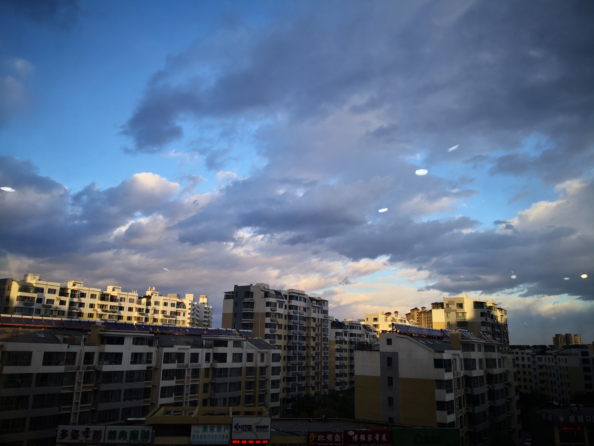

# 天蝎座 Scorpio \(10/24 - 11/22\)

### 2018.10.24

下午三点，去健身房的路上，艺院楼下：

### 2018.10.26

今天天气很好，所以就多照了几张，中午，正大美食附近，识别结果为：

（名称：槐；特点：喜欢阳光，讨厌阴凉，是庭院常用的特色树种）

西区大食堂附近找了最红的一棵“鸡爪槭”，叶瓣似柳叶，颜色如火，所以又称它为柳叶枫：

吃完饭后在西区大食堂三楼拍摄：

在材料学院外面的路口拍摄，感觉很棒：

下午三点，第一次走艺院楼后面的一条小路，看到了这样的风景:

经识别为“芦苇”，又名蒹葭：

### 2018.10.27

下午四点半，做了实验出来，理学楼附近，有种对称之美：

2018.10.28

下午四点，在四楼赛奥健身房拍摄，感觉又有卷云又有积云：

### 2018.11.12

最近天气都不怎么好，因为北方这边开始供暖了，下午五点，老地方拍摄，轻度污染，加大雾黄色预警：：

`#之前插的图都是被word自动修改过后的，清晰度很低，以后都尽量放原图上来了，虽然这样可能加载会比较慢`

中午去西大食堂，注意到的草坪一角风景：落叶点缀在草坪上，富有美感。

### 2018.11.14

上午七点半，重度污染+大雾黄色预警：

### 2018.11.15

上午七点半,重度污染：

### 2018.11.16

深蓝+淡蓝+淡灰，上午12点

### 2018.11.19

西区大食堂三楼，下午五点半，天就已经完全黑下来了。

