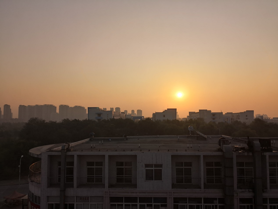

# 天秤座 Libra \(09/23 - 10/23\)

### 2018.9.23

清晨七点，燕大东区 。难得这条路上人这么少，阳光倾泻下来，宽敞空旷，宁静温暖。

午后，吃了超级咸的铁锅焖面后，路过燕鸣湖时拍摄，我看着这场景想到了天眼射电望远镜：

下午两点，我是大二的时候才知道可以直接从图书馆看到海的。为了拍这张图我还特地去了躺图书馆七楼：

下午出图书馆，看到外面景色的一瞬间，我就后悔早上来的时候没带手机充电器了（因为没带充电器，所以我现在手机只有7%的电了，而外面的景色简直是美如画，我却不能多拍几张了。今天是个值得纪念的日子，2018年中秋节的前一天，也是天枰座的开端，风景美得不像话）：

### 2018.9.24

中午，里仁学院圆形大转盘附近，昨天天上还到处都是云，今天就真真正正万里无云了，这张已被我设为桌面壁纸；

在图书馆附近，捡到一个红色果子，这是桑葚？不像呀。

晚上七点，在图书馆外面特意找的角度，毕竟今天中秋节嘛，有必要拍张月亮，最上面的那个圆球就是月亮：

### 2018.9.26 

听了导员讲档案归属地的事，出来去西区大食堂的路上，看到了这抹惊艳的绿色：（这张成为了新的桌面壁纸，我体会到把自己拍的照片当桌面壁纸又有意思又有成就感） （经形色app识别，植物名：龙柏，柏科·圆柏属）

### 2018.9.27

清晨六点半，宿舍走廊的景象，让我想起了监狱或者是医院：

走过去，在11组团六楼，拍的朝阳：

中午一点过，西区四体附近的一处景色：

中午，东区图书馆附近的一棵雪松，常绿乔木：

### 2018.9.29

下午一点，四体旁花丛里的白色牵牛花：

下午六点，东区图书馆外的景色，粉红色的云，凡是抬了头的校友都拿出了手机：

### 2018.9.30

今天天朗气清，所以照片有点多。中午去西区大食堂吃饭的路上，路过10组女生组团时：

路过女生组团时，明暗十分明显的积云：

吃完回寝室，在六楼窗台往四体拍摄，积云较多，远方的看着像碎层云，但碎层云是灰白色，且常出现在雨后清晨：

去健身房路过四体时，感觉这是层云：

下午去健身房路过明日星城时，路边的花： （形色APP识别为，花名：八宝，可做中草药，清热解毒、散瘀消肿，花语：吉祥；）

从健身房回寝室的路上，路过四体旁农业银行ATM机旁边花丛时注意到了它，是在风吹动它的时候拍摄的，随风摇曳的样子，像个穿白裙子的女生在跳舞一样： （形色APP识别为，花名：秋英，也叫波斯菊）

### 2018.10.1国庆节

清晨五点过的样子，和黄洋洋、陈振江在海边照的一些图，当时是去看日出来着， 结果太阳被云给遮住了orz：

刚开始是这样，海与黑云的夹缝之间露出一道朝霞，让我们看到了希望：

然后是这样，下面的光没了，转移到了云层上方：

过了一会儿就变成了这样，场面十分壮观，感觉像佐助来了一记红色的“天照”，把那些云给点燃了：

前三张都是拍的左侧，这是右侧的风景，我从这张图里看到了两架战斗机：

之后是这样，红色天照都被熄灭了：

再之后就成了这样，我感觉不像日出像日落orz：

回头一望，发现后面的景色也挺好看，这是秦皇岛最具特色的建筑了，似乎是叫海碧台，是住宿楼。（成为了我的新桌面壁纸）

### 2018.10.2海上日出

清晨五点过，于里仁学院拍摄，当时天上都是繁星，然而手机拍出来效果并不好，就没留下来：

清晨五点半左右，赶到沙滩时，是这个情景：

日出后是这个情景：

整个过程被我录了下来，上传到了优酷上，时长十来分钟，不过得看一分钟广告，然后声音开大点才能听见我的自言自语，这里是[链接](http://v.youku.com/v_show/id_XMzg0NjQxMDA0OA==.html)。田大美女看了这个视频后，帮我拼了一个长图：

厉害了😋

